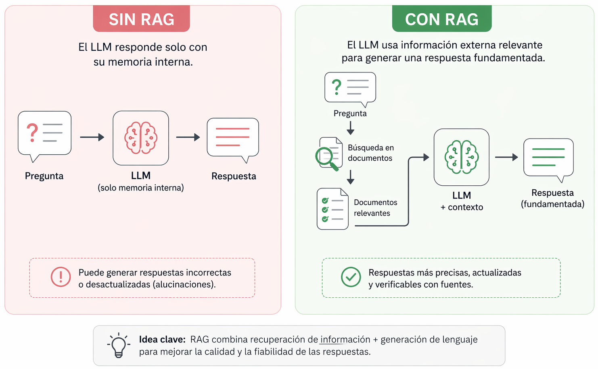
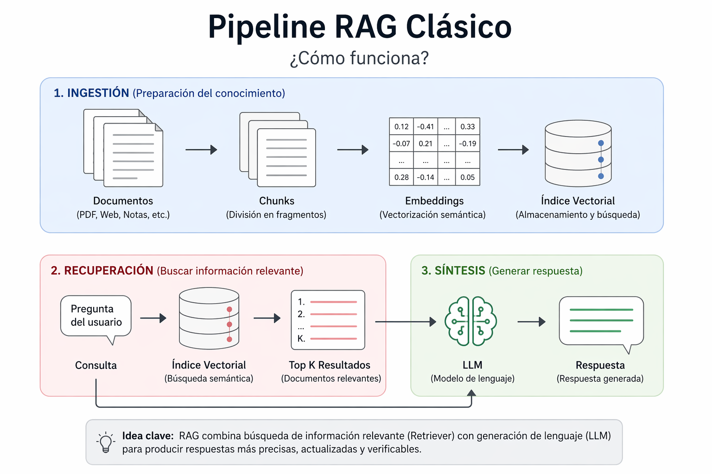
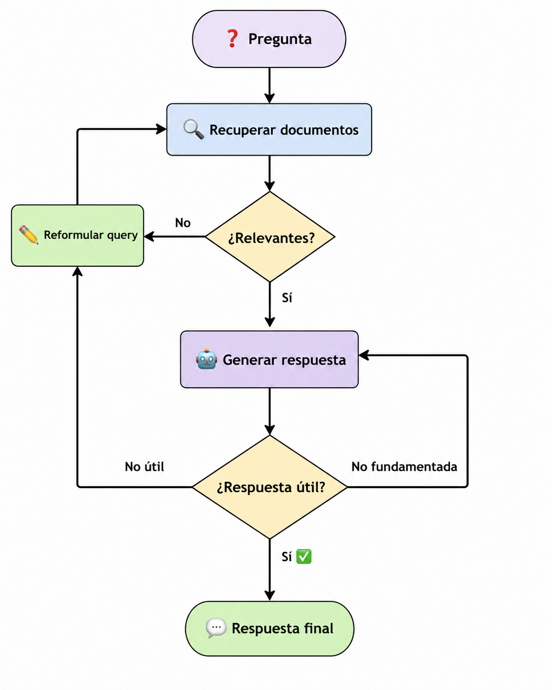
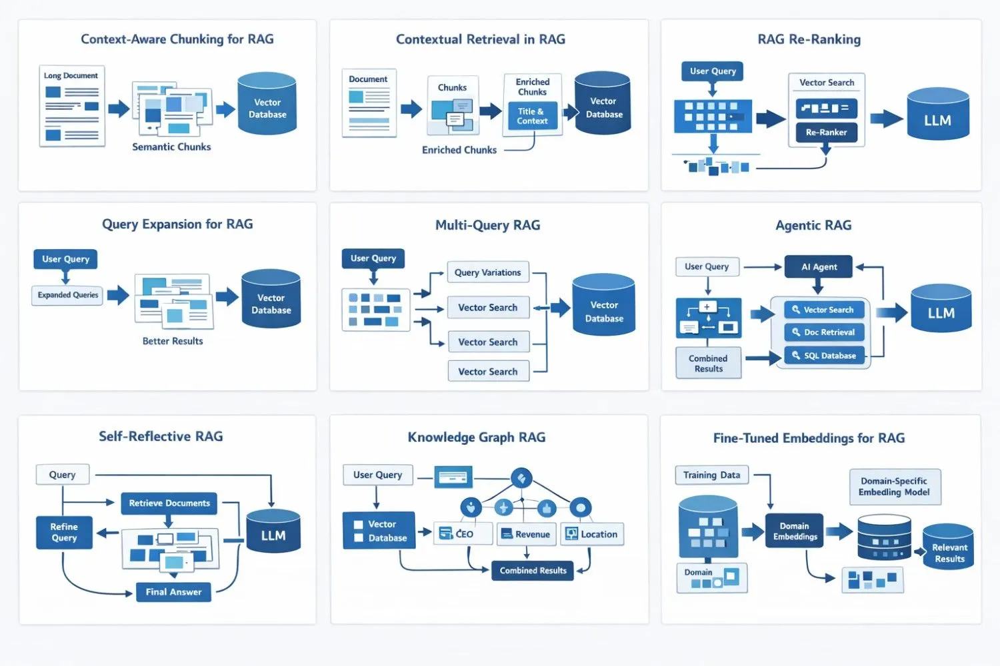

## { .portada  #portada}

<div class="logo-box">
  
</div>

<div class="title-area">
  <h1>Retrieval-Augmented Generation (RAG)</h1>

  <h2>Unidad de Gobierno de Datos</h2>

  <p><strong>Abril 2026</strong></p>
</div>

## Outline

<div class="agenda-grid">
  <div class="agenda-item"><h3>01</h3><p><strong>El problema</strong><br>Limitaciones de los LLMs y por qué necesitamos algo más</p></div>
  <div class="agenda-item"><h3>02</h3><p><strong>La solución RAG</strong><br>Qué es, cómo funciona y qué lo hace diferente</p></div>
  <div class="agenda-item"><h3>03</h3><p><strong>Arquitectura y componentes</strong><br>Los 6 bloques que forman un sistema RAG</p></div>
  <div class="agenda-item"><h3>04</h3><p><strong>Implementación</strong><br>Pipeline completo con LangChain y OpenRouter</p></div>
  <div class="agenda-item"><h3>05</h3><p><strong>Más allá de lo básico</strong><br>Estrategias avanzadas, evaluación con RAGAs</p></div>
  <div class="agenda-item"><h3>06</h3><p><strong>Casos de uso y límites</strong><br>Cuándo usar RAG, cuándo no, y próximos pasos</p></div>
</div>

## 01 · El problema: ¿qué no pueden hacer los LLMs?

Los modelos de lenguaje son poderosos, pero tienen **limitaciones estructurales**:

:::: {.columns}
::: {.column width="50%"}

<div class="problem-box"><h4>❌ Conocimiento estático</h4><p>Su saber se congela en la <strong>fecha de corte</strong> del entrenamiento. Nada de lo que ocurrió después existe para ellos.</p></div>

<div class="problem-box"><h4>❌ Sin acceso a documentos privados</h4><p>No conocen los manuales, reportes ni bases de datos <strong>de tu organización</strong>.</p></div>

<div class="problem-box"><h4>❌ Alucinaciones</h4><p>Cuando no saben, <strong>inventan</strong> con total confianza. No citan fuentes, no admiten ignorancia.</p></div>

:::

::: {.column width="50%"}

Preguntas que los LLMs no pueden responder bien

> *"¿Cuál es el código CIUO-08-CL para un pirquinero?"*

> *"¿Cómo ha evolucionado la tasa de desempleo según la última ENE en Chile?"*

> *"¿Cuál es la población de Curanilahue según el último censo?"*

<div class="callout-note"><p>Estas preguntas requieren documentos específicos que el LLM nunca vio durante su entrenamiento.</p></div>

:::
::::


## 02 · La solución: qué es RAG

> **RAG** (Retrieval-Augmented Generation) = buscar primero, generar después.

Antes de responder, el sistema **recupera documentos relevantes** y los entrega al LLM como contexto.

<!-- :::: {.columns}
::: {.column width="50%"}
### Sin RAG
```
Pregunta → LLM → Respuesta
                (solo memoria interna)
```
:::
::: {.column width="50%"}
### Con RAG
```
Pregunta → Búsqueda en documentos
         → Documentos relevantes
         → LLM + contexto → Respuesta
                            (fundamentada)
```
:::
:::: -->

{.r-stretch}


## 03a · Arquitectura RAG: el flujo completo


{.r-stretch}

::: notes
Los documentos sin procesar, suelen ser demasiado grandes para que la mayoría de los LLM los procesen todos a la vez. Por lo tanto, necesitamos dividirlos en fragmentos más pequeños y fáciles de procesar.

La elección del tamaño de los fragmentos en RAG es crucial. Debe ser lo suficientemente pequeño para garantizar la relevancia y reducir el ruido, pero lo suficientemente grande para mantener la integridad del contexto.

Una vez dividido, cada segmento de texto se transforma en una representación vectorial numérica (un embedding) que captura su significado semántico.

Los fragmentos se almacenan en una base de datos vectorial especializada.

Estas bases de datos usan búsqueda por similitud, que permite una rápida recuperación de fragmentos relevantes para la consulta del usuario. 

Cuando un usuario envía una consulta, se activa el proceso de recuperación

La consulta se transforma primero en un vector utilizando el mismo modelo de embedding empleado para crear la base de datos de vectores. 

A continuación, la base de datos compara este vector de consulta con los millones de vectores de fragmentos almacenados.

La proximidad o similitud se mide normalmente usando la similitud de coseno

Una vez recuperado el contexto relevante se envía al modelo de lenguaje (GPT-4, Claude, Llama, Gemini, etc.), que sintetiza la información recuperada para generar una respuesta referenciada.

:::
## 03b · Los 6 componentes principales

| Componente | Qué hace | Ejemplo típico |
|---|---|---|
| **Document Loader** | Carga documentos de diversas fuentes | `PyPDFLoader`, `WebBaseLoader` |
| **Text Splitter** | Divide documentos en fragmentos (chunks) | 500 tokens, solapamiento 50 |
| **Embedding Model** | Convierte texto en vectores numéricos | `all-MiniLM-L6-v2`, `multilingual-e5` |
| **Vector Store** | Almacena y busca vectores eficientemente | ChromaDB, FAISS, Pinecone |
| **Retriever** | Recupera chunks relevantes para una pregunta | Top-3 por similitud coseno |
| **LLM** | Genera la respuesta final con el contexto | GPT-4 (OpenAI), Claude (Anthropic), Gemini (Google), Llama 3 (Meta) |

::: {.callout-tip}
**Para empezar:** `PyPDFLoader` + `RecursiveCharacterTextSplitter` + `HuggingFaceEmbeddings` + `ChromaDB` es la combinación más portable y sin costos.
:::


## 04a · Pipeline RAG completo con LangChain {.full-code}


```python
from langchain_community.document_loaders import PyPDFLoader  
from langchain_text_splitters import RecursiveCharacterTextSplitter 
from langchain_community.embeddings import HuggingFaceEmbeddings
from langchain_community.vectorstores import Chroma 
from langchain_openai import ChatOpenAI 
from langchain_core.prompts import PromptTemplate 
from langchain_core.runnables import RunnablePassthrough 

loader = PyPDFLoader("reporte_anual.pdf") # <1>
docs = loader.load() # <1>

splitter = RecursiveCharacterTextSplitter(chunk_size=500, chunk_overlap=50) # <2>
chunks = splitter.split_documents(docs) # <2>

embeddings = HuggingFaceEmbeddings(model_name="all-MiniLM-L6-v2")  # <3>
vectorstore = Chroma.from_documents(chunks, embeddings) # <3>

retriever = vectorstore.as_retriever(search_type = "similarity", k=3)  # <4>

prompt = PromptTemplate("Eres un asistente experto en análisis de reportes. Responde a la pregunta usando SOLO el  siguiente contexto:\n\n{context}\n\nPregunta: {question}\nRespuesta:") # <5>

llm = ChatOpenAI(                               # <6>
    base_url="https://openrouter.ai/api/v1",    
    api_key="sk-or-...",                        
    model="meta-llama/llama-3.3-70b-instruct:free"  
) # <6>

chain  = ( # <7>
    {"question": RunnablePassthrough(), "context": retriever}
    | prompt 
    | llm 
)  # <7>

respuesta = chain.invoke("¿Cuáles fueron los principales hallazgos?")  # <8>

```
1. Carga el PDF completo — cada página queda como un objeto `Document` con texto y metadatos
2. Divide el texto en fragmentos de 500 caracteres con 50 de solapamiento para no perder contexto entre chunks
3. Convierte cada chunk a vector con un embedding multilingüe y los persiste en ChromaDB (solo se ejecuta una vez)
4. Crea el retriever: ante cada pregunta, busca los 3 chunks más similares semánticamente
5. Define el prompt que instruye al LLM a responder **solo** con el contexto recuperado
6. Conecta al LLM gratuito via OpenRouter con una API compatible con OpenAI
7. Encadena retriever + prompt + LLM usando la sintaxis LCEL (`|`): cada componente recibe el output del anterior
8. Invoca la cadena completa — el retriever busca contexto, el prompt lo formatea y el LLM genera la respuesta

::: notes
chunk_size=500 significa que cada trozo puede tener máximo 500 caracteres

chunk_overlap=50 significa que cada trozo comparte 50 caracteres con el trozo siguiente. Esto existe para no perder contexto en los bordes — si una idea empieza al final de un trozo y termina al principio del siguiente, el solapamiento garantiza que algún trozo la tenga completa.

LCEL significa LangChain Expression Language — es la sintaxis del símbolo | que viste en el pipeline RAG.La idea es simple: el | significa "pasa el output de esto al input de lo siguiente", igual que en una línea de producción:

RunnablePassthrough() básicamente dice "toma lo que llegó y déjalo pasar tal cual" — su único trabajo es reenviar la pregunta original al key question del diccionario mientras el retriever trabaja en paralelo generando el context.
:::

## 04b · LangChain: el framework para construir con LLMs

> LangChain es una librería Python que provee bloques estándar para cada componente de un pipeline LLM y una sintaxis simple (`|`) para encadenarlos.

:::: {.columns}
::: {.column width="50%"}

### Ecosistema de paquetes

| Paquete | Qué provee |
|---|---|
| `langchain-core` | Prompts, LCEL, interfaces base |
| `langchain-community` | Loaders, embeddings, vector stores |
| `langchain-openai` | LLMs compatibles con OpenAI |
| `langchain-huggingface` | Embeddings y modelos de HuggingFace |
| `langchain-chroma` | Integración con ChromaDB |
| `langchain` | Chains y agentes de alto nivel |

<div class="callout-note"><p>Cada paquete tiene su propio ciclo de vida — si ChromaDB cambia su API, solo se actualiza <code>langchain-chroma</code> sin afectar el resto.</p></div>

:::
::: {.column width="50%"}

### LCEL: encadenar componentes con `|`

```python
from langchain_core.runnables import RunnablePassthrough
from langchain_core.prompts import PromptTemplate
from langchain_openai import ChatOpenAI

chain = (
    {"question": RunnablePassthrough(),
     "context": retriever}
    | prompt
    | llm
)

# Un solo invoke ejecuta toda la cadena:
# retriever busca → prompt se arma → llm responde
chain.invoke("¿Cuál es el código CIUO de un podólogo?")
```

<div class="callout-tip"><p>LangChain se basa en la idea de encadenar operaciones. En esencia, es un pipeline de trabajo donde cada paso depende del resultado del anterior.</p></div>

:::
::::

## 04c · LangChain: el problema con LangChain agents

LangChain tiene un loop interno que tú **no controlas directamente**: 

:::: {.columns}
::: {.column width="50%"}

- Los **agentes** combinan modelos de lenguaje con herramientas para crear sistemas que pueden razonar sobre las tareas, decidir qué herramientas usar y trabajar de forma iterativa para encontrar soluciones.
- Las **herramientas** son funciones Python normales que el agente puede invocar cuando las necesita.
- El agente se ejecuta hasta que se cumple una condición de parada, es decir, cuando el modelo emite una salida final o se alcanza un límite de iteraciones. 
- No puedes pausarlo, inspeccionarlo ni meter una aprobación humana en el medio.

:::

::: {.column width="50%"}

```python
from langchain.agents import create_react_agent, AgentExecutor
from langchain.tools import tool

# Herramienta 1: buscar en documentos
@tool
def buscar(pregunta: str) -> str:
    """Busca información."""
    return retriever.invoke(pregunta)  # el RAG que ya conocemos

# Herramienta 2: calculadora
@tool  
def calcular(operacion: str) -> str:
    """Ejecuta una operación matemática."""
    return str(eval(operacion))

# El agente tiene acceso a ambas herramientas
tools = [buscar, calcular]
agente = create_react_agent(llm, tools, prompt)
executor = AgentExecutor(agent=agente, tools=tools)

executor.invoke({"input": "¿Cuáles fueron los ingresos anuales?"})
```
:::
::::

<div class="callout-note"><p>El LLM no <em>ejecuta</em> las herramientas — solo decide <em>cuándo</em> llamarlas y con qué argumentos.</p></div>

::: notes
- Un agente LLM solicita herramientas en bucle para lograr un objetivo. 
- El agente decide en cada paso si ya tiene suficiente información para responder o si necesita consultar algo más.
:::

## 04d · LangGraph: cuando el pipeline necesita tomar decisiones 

> LangGraph extiende LangChain para construir pipelines que no son lineales — donde el flujo puede ramificarse, repetirse o decidir qué hacer según el resultado de cada paso.

:::: {.columns}
::: {.column width="50%"}

### Lo que agrega LangGraph

- Un RAG básico es lineal: pregunta → retriever → LLM → respuesta. 
- LangGraph permite construir flujos donde el sistema puede, por ejemplo, evaluar si la respuesta fue suficiente y volver a buscar si no lo fue.
- LangGraph te obliga a definir ese loop como un **grafo explícito**.
- Defines tú mismo cada nodo y cada transición — el flujo deja de ser una caja negra.

| Capacidad | LangChain | LangGraph |
|---|---|---|
| Agente simple | ✅ | innecesario |
| Pausar y aprobar pasos | ❌ | ✅ |
| Flujos condicionales | ❌ | ✅ |
| Estado persistente | ❌ | ✅ |
| Debugging paso a paso | difícil | ✅ |

:::

::: {.column width="50%"}

{.r-stretch}

:::
::::

## 04e · OpenRouter: acceso a múltiples modelos

**OpenRouter** es una API unificada (compatible con OpenAI) que da acceso a modelos de varios proveedores.

```python
from langchain_openai import ChatOpenAI

llm = ChatOpenAI(
    base_url="https://openrouter.ai/api/v1",
    api_key="sk-or-...",           # API key de OpenRouter
    model="meta-llama/llama-3.3-70b-instruct:free",  # GRATIS
)
```

### Modelos gratuitos útiles para pruebas


| Modelo | Contexto | Uso ideal |
|---|---|---|
| `meta-llama/llama-3.3-70b-instruct:free` | 66K tokens | RAG general, mejor soporte en español |
| `google/gemma-4-31b-it:free` | 262K tokens | Multilingüe (140+ idiomas), documentos largos |
| `qwen/qwen3-next-80b-a3b-instruct:free` | 262K tokens | Optimizado para RAG y tool use |
| `openai/gpt-oss-20b:free` | 131K tokens | Rápido y liviano, ideal para pruebas |
| `nvidia/nemotron-3-super-120b-a12b:free` | 1M tokens | Contexto máximo, tareas complejas |

> Obtén tu API key gratis en [openrouter.ai](https://openrouter.ai)


## 05a · ⚠️ Por qué falla el retrieval básico

> *"Buscar los top 5 chunks y rezar no es una estrategia — es un punto de partida."*

:::: {.columns}
::: {.column width="50%"}

**1. El chunking rompe el significado**
Una idea se parte en dos fragmentos. Ninguno es suficiente por sí solo para responder la pregunta.

**2. Similitud matemática ≠ relevancia real**
Un chunk puede estar "cerca" de la consulta en el espacio vectorial y aun así no contener la respuesta.

**3. Los usuarios no hacen preguntas perfectas**
Una consulta corta necesita ser expandida antes de que el retriever tenga alguna chance de encontrar el material correcto.

:::
::: {.column width="50%"}

**4. Algunas respuestas necesitan más contexto del que un chunk puede dar**
Un párrafo solo puede no ser suficiente — a veces el modelo necesita la sección completa o el documento entero.

**5. No todas las preguntas deberían usar el mismo retrieval**

| Tipo de pregunta | Retrieval ideal |
|---|---|
| Conceptual | Búsqueda semántica |
| Término exacto / código | BM25 / keyword |
| Datos estructurados | SQL / filtro |
| Entidades relacionadas | Knowledge graph |

:::
::::


## 05b · Estrategias avanzadas de retrieval 

:::: {.columns}
::: {.column width="50%"}
| Estrategia | Descripción | Cuándo usar |
|---|---|---|
| **MMR** | Evita chunks redundantes | Docs repetitivos |
| **Hybrid** | BM25 + vectores | Términos exactos |
| **Multi-query** | Variantes de la pregunta | Preguntas ambiguas |
| **Compresión** | Extrae parte relevante | Chunks grandes |
| **Re-ranking** | Segundo modelo de orden | Alta precisión |
:::
::: {.column width="50%"}
```python
retriever = vectorstore.as_retriever(
    search_type="mmr",
    search_kwargs={"k": 5, "fetch_k": 20, "lambda_mult": 0.7}
)

bm25_retriever = BM25Retriever.from_documents(
    documents=docs_split,
    k=10)

hybrid_retriever = EnsembleRetriever(
    retrievers=[
        bm25_retriever,  # Sparse (keywords)
        retriever,       # Dense semántico
    ],
    weights=[0.5, 0.5])
```
:::
::::

::: notes
Los parámetros:

search_type="mmr" — el algoritmo de búsqueda. MMR significa Maximal Marginal Relevance. En vez de devolver simplemente los 5 chunks más similares a la pregunta, busca chunks que sean relevantes y diversos entre sí — evita devolverte 5 veces el mismo párrafo con palabras distintas.

fetch_k=20 — primero recupera los 20 chunks más similares a la pregunta por similitud coseno normal.

k=5 — de esos 20, selecciona los 5 mejores aplicando el criterio MMR (relevancia + diversidad). Siempre fetch_k > k.

lambda_mult=0.7 — controla el balance entre relevancia y diversidad:

1.0 → solo relevancia    (MMR se comporta como similarity search normal)
0.0 → solo diversidad    (chunks muy distintos entre sí aunque sean poco relevantes)
0.7 → 70% relevancia, 30% diversidad  ← valor típico recomendado

BM25Retriever — búsqueda por palabras clave clásica (sparse). Es el algoritmo detrás de buscadores como Google antes del machine learning. Busca coincidencias exactas de palabras y les da un puntaje según frecuencia. No entiende semántica pero es muy bueno cuando la pregunta tiene términos exactos como códigos, siglas o nombres propios.

EnsembleRetriever — combina ambos con un peso para cada uno

Contextual Compression es una técnica que en vez de devolver el chunk completo, extrae solo la parte del chunk que es relevante para la pregunta.La desventaja es que usa el LLM dos veces — una para comprimir y otra para responder — lo que duplica la latencia y el costo. Por eso se usa principalmente cuando los chunks son muy grandes o cuando el contexto tiene mucho ruido.

RAG Re-Ranking
El retriever devuelve los top-K chunks por similitud vectorial, pero la similitud coseno no siempre refleja relevancia real. Un segundo modelo (CrossEncoder) reordena esos K chunks evaluando cada uno contra la pregunta en profundidad. Más lento, pero más preciso.
:::

## 05c · El ecosistema RAG avanzado

> El RAG básico es el punto de partida. Estas son las direcciones en las que puedes profundizar:

{.r-stretch}


::: notes
Context-Aware Chunking
En vez de dividir el documento cada N caracteres, detecta la estructura semántica del texto usando  Embeddings semánticos — párrafos, secciones, ideas completas — y corta respetando esos límites. Resultado: cada chunk tiene una idea completa, no frases cortadas a la mitad. Convierte cada oración en un vector y mide la similitud coseno entre oraciones consecutivas. Cuando la similitud cae bruscamente, detecta un cambio de tema y corta ahí. La desventaja es el costo — necesitas calcular embeddings para cada oración durante la indexación, lo que es mucho más lento que simplemente contar caracteres.

Contextual Retrieval
Antes de indexar, enriquece cada chunk agregándole el título de la sección y un resumen del documento al que pertenece. Así el vector no representa solo el fragmento sino su contexto dentro del documento completo — mejora mucho la recuperación en documentos largos.

RAG Re-Ranking
El retriever devuelve los top-K chunks por similitud vectorial, pero la similitud coseno no siempre refleja relevancia real. Un segundo modelo (CrossEncoder) reordena esos K chunks evaluando cada uno contra la pregunta en profundidad. Más lento, pero más preciso.

Query Expansion
Antes de buscar, expande la pregunta original generando variantes o términos relacionados. Si alguien pregunta "empleo informal", también busca "trabajo no registrado", "sector informal", "sin contrato". Captura más chunks relevantes que una búsqueda literal.

Multi-Query RAG
Similar a query expansion pero más agresivo: el LLM genera N versiones distintas de la pregunta, se hacen N búsquedas en paralelo y los resultados se combinan y deduplicán. Útil cuando la pregunta es ambigua o puede responderse desde ángulos distintos.

Agentic RAG
En vez de un pipeline fijo (pregunta → retriever → LLM), un agente decide dinámicamente qué herramienta usar: búsqueda vectorial, consulta SQL, búsqueda web, recuperación de documentos específicos. El LLM actúa como orquestador que razona sobre qué fuente consultar según la pregunta.

Self-Reflective RAG
Después de generar la respuesta, el LLM la evalúa: ¿está fundamentada en el contexto? ¿respondió la pregunta? Si detecta que la respuesta es insuficiente, refina la búsqueda y vuelve a intentarlo. Agrega un loop de autocorrección al pipeline básico.

Knowledge Graph RAG
A diferencia de un RAG básico que utiliza una base de datos vectorial para recuperar texto semánticamente similar, GraphRAG mejora RAG incorporando grafos de conocimiento (KG). Los grafos de conocimiento son estructuras de datos que almacenan y vinculan datos en función de sus relaciones.
Ejemplo: "¿Qué ocupaciones del gran grupo 2 trabajan en el sector minero?"

Para responder eso necesitas conectar información de dos clasificadores distintos (CIUO y CAENES) que en el texto plano están en documentos separados sin ningún vínculo explícito. El retriever vectorial recuperaría chunks del gran grupo 2 O chunks del sector minero, pero no sabría conectarlos.

Fine-Tuned Embeddings
En vez de usar un modelo de embeddings genérico, lo entrenas con datos de tu dominio específico. El modelo aprende que en tu contexto "glosa" y "descripción ocupacional" son sinónimos, o que "CIUO" y "clasificador" están relacionados. Mejora el retrieval en dominios técnicos donde el lenguaje es muy especializado.
::: 

## 05d · Evaluación de un sistema RAG

Un buen RAG necesita métricas en **dos dimensiones**:

:::: {.columns}
::: {.column width="50%"}
### Retrieval
- **Precision@K**: fracción de chunks útiles en top-K 

  - (Nº de documentos relevantes en el top K) / K

- **Recall@K**: ¿está el chunk relevante en los top-K? 

  - (Nº de documentos relevantes en el top K) / (Total de documentos relevantes en el corpus)

- **MRR**: posición promedio del primer resultado correcto 
:::
::: {.column width="50%"}
### Generación
- **Faithfulness**: ¿la respuesta está fundamentada en el contexto?
- **Answer Relevancy**: ¿responde la pregunta?
- **Context Utilization**: ¿usa bien el contexto?
:::
::::

### Framework: RAGAs

```python
from ragas import evaluate
from ragas.metrics import faithfulness, answer_relevancy, context_recall

resultado = evaluate(dataset, metrics=[faithfulness, answer_relevancy, context_recall])
```
::: notes
Precision answers a simple question. Out of everything you retrieved, how much of it was actually useful?
A precision of 0.60 at K=5 means your context window is 40% garbage. Every irrelevant document increases the chance of a confused, diluted, or hallucinated answer.

If your precision is dropping, you need to look at your embedding model. Your similarity threshold is too loose. You are retrieving documents that are only tangentially related to the query.

Precision is a purity metric. It tells you whether your retrieval has a noise problem.

Recall asks the opposite question. Out of everything that should have been retrieved, how much did you actually find?

Low recall means your users are getting incomplete answers. They are not seeing important perspectives.

If your recall is low, you need to retrieve more documents (increase K). Or you need a better embedding model that captures semantic similarity more broadly.

As K increases, precision drops and recall rises. You are pulling in more documents, which means you find more relevant ones (recall goes up), but you also let in more noise (precision goes down).

Mean Reciprocal Rank (MRR): It measures speed. How quickly does the first relevant document appear in your ranked results?

An MRR of 1.0 means every single query gets its first relevant document at position 1.

In a RAG system, the order of retrieved documents affects the generated answer. Most LLMs pay more attention to the documents that appear first in the context.

If your first relevant document is buried at position 3 and positions 1 and 2 are noise, the model might give more weight to the noise.
:::

## 06a · Casos de uso reales

:::: {.columns}
::: {.column width="50%"}
### 💬 RAG como chatbot
Un asistente conversacional que responde preguntas sobre la CIUO-08-CL consultando el manual oficial, con citas de página.

**¿Qué puede hacer?**

- Resolver dudas sobre definiciones y criterios de clasificación
- Comparar grupos ocupacionales similares
- Citar la página exacta del manual como fuente

**Estrategia**

- Vectorless RAG (PageIndex)

**Stack** 

- PageIndex + LangChain + Gradio + OpenRouter

[🔗Chatbot CIUO](http://10.92.121.113:7860/)
:::
::: {.column width="50%"}
### 🏷️ RAG como clasificador
Un pipeline que recibe una glosa ocupacional y devuelve su código CIUO-08-CL y CAENES, expuesto como API REST para integrarse con otros sistemas.

**¿Qué puede hacer?**

- Clasificar glosas en diferentes niveles de desagregación
- Procesar miles de registros vía API
- Integrarse con pipelines de producción existentes

**Estrategia** 

- RAG agentico + re-ranking + retriever híbrido 

**Stack** 

- LangChain + FastAPI + ChromaDB + OpenRouter

[🔗 Clasificador RAG CIUO-CAENES](http://10.92.121.113:8001/docs)
:::
::::

## 06b · Limitaciones y desafíos

:::: {.columns}
::: {.column width="50%"}

### ⚙️ Limitaciones técnicas

- **Respuestas distribuidas** — cuando la respuesta requiere sintetizar información de múltiples chunks o secciones, el retriever recupera fragmentos pero ninguno la contiene completa
- **Chunking imperfecto** — los fragmentos pueden romper tablas, mezclar secciones y perder contexto entre uno y otro
- **Lost in the middle** — el LLM tiende a ignorar los chunks del centro del contexto, aprovechando mejor el inicio y el final
- **Sensibilidad a la formulación** — la misma pregunta escrita distinto puede recuperar chunks completamente diferentes

:::
::: {.column width="50%"}

### 🏗️ Desafíos prácticos

- **Documentos difíciles** — PDFs escaneados, tablas, imágenes y columnas se convierten mal a texto plano
- **El LLM puede ignorar el contexto** — si el modelo no encuentra la respuesta en los chunks entregados, puede responder desde su memoria interna en vez de admitir que no sabe
- **Latencia doble** — retrieval + generación en secuencia hace el sistema más lento que un LLM directo
- **Mantenimiento del índice** — cuando los documentos cambian hay que re-indexar; sin un pipeline de actualización el vectorstore queda desactualizado

:::
::::

> **Regla de oro:** El 80% del trabajo en RAG no es el LLM, es limpiar, estructurar y fragmentar bien los documentos.


## 06c · Recursos para seguir aprendiendo

### 📚 Documentación oficial
- [LangChain](https://docs.langchain.com/oss/python/langchain/overview) — framework principal
- [LangGraph](https://docs.langchain.com/oss/python/langgraph/overview) — agentes y flujos controlados
- [OpenRouter](https://openrouter.ai/docs) — API unificada de modelos gratuitos
- [ChromaDB](https://docs.trychroma.com) — vector store local
- [RAGAs](https://docs.ragas.io) — evaluación automatizada de pipelines RAG

### 📄 Papers fundamentales
- Lewis et al. (2020) — *Retrieval-Augmented Generation for Knowledge-Intensive NLP Tasks* — el paper que inventó RAG
- Es et al. (2023) — *RAGAS: Automated Evaluation of RAG Pipelines* — métricas estándar de evaluación
- Anthropic (2024) — *Contextual Retrieval* — cómo enriquecer chunks antes de indexar

### 🎓 Para aprender haciendo
- [LangChain Academy](https://academy.langchain.com) — cursos oficiales gratuitos, incluye RAG y LangGraph
- [DeepLearning.AI — LangChain courses](https://www.deeplearning.ai/short-courses/) — cursos cortos gratuitos de RAG y LLMs, en inglés


